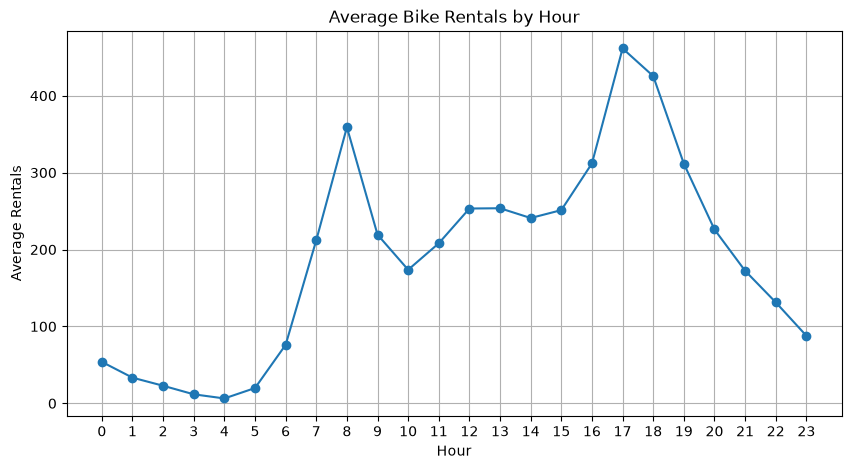
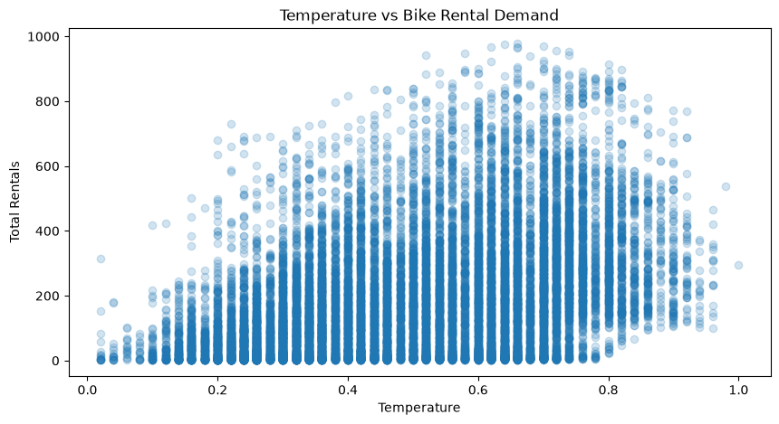
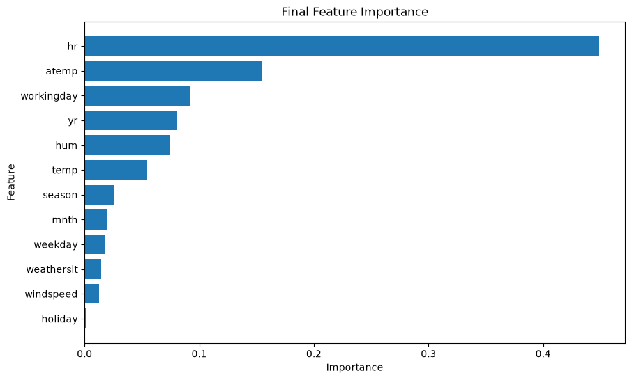

# 🚲 Bike Sharing Demand Prediction

A machine learning regression project for predicting total bike rental demand using the UCI Bike Sharing Dataset.

## 📌 Project Overview

The goal of this project is to build a machine learning model that predicts the total number of bike rentals (`cnt`) based on temporal, environmental, and weather-related features.

The project follows a complete machine learning workflow, from exploratory data analysis and preprocessing to model comparison, cross-validation, hyperparameter tuning, and model interpretation.

---

## 🎯 Objective

Predict the total number of bike rentals and identify the factors that have the greatest influence on rental demand.

**Target variable:** `cnt` — total number of bike rentals.

---

## 📊 Dataset

The project uses the **hourly** version of the UCI Bike Sharing Dataset.

* **Observations:** 17,379
* **Features used:** 12
* **Target:** `cnt`

The following columns were excluded:

* `instant` — record index
* `dteday` — original date column
* `casual` — directly contributes to `cnt`
* `registered` — directly contributes to `cnt`

`casual` and `registered` were excluded to prevent data leakage because they are components of the target variable.

---

## 🔍 Exploratory Data Analysis

The analysis focused on understanding how bike rental demand changes according to:

* Hour of the day
* Working vs. non-working days
* Seasons
* Weather conditions
* Temperature
* Humidity
* Other environmental factors

The analysis showed that **hour** is particularly important for predicting rental demand, while weather and environmental conditions also contribute to demand patterns.

---

## 📊 Visualizations

### Average Bike Rentals by Hour



### Temperature vs Bike Rental Demand



### Final Feature Importance



---

## ⚙️ Preprocessing

Categorical features were transformed using **One-Hot Encoding**.

Numerical features were passed through without transformation.

A `ColumnTransformer` was used to apply preprocessing consistently.

### Categorical Features

* `season`
* `yr`
* `mnth`
* `hr`
* `holiday`
* `weekday`
* `workingday`
* `weathersit`

### Numerical Features

* `temp`
* `atemp`
* `hum`
* `windspeed`

The preprocessing steps were integrated into Scikit-learn Pipelines.

---

## 🤖 Models

The following regression models were evaluated:

1. Baseline
2. Decision Tree Regressor
3. Random Forest Regressor
4. Gradient Boosting Regressor

Random Forest and Gradient Boosting were further optimized using `GridSearchCV`.

---

## 📈 Model Performance

| Model                   |     MAE ↓ |    RMSE ↓ |      R² ↑ |
| ----------------------- | --------: | --------: | --------: |
| Baseline                |    140.08 |    178.03 |    -0.001 |
| Decision Tree           |     40.06 |     66.29 |     0.861 |
| Random Forest           | **29.80** | **47.87** | **0.928** |
| Gradient Boosting       |     58.00 |     79.90 |     0.798 |
| Tuned Random Forest     | **29.57** | **47.45** | **0.929** |
| Tuned Gradient Boosting |     46.85 |     66.37 |     0.861 |

### Cross-Validation

Time-based cross-validation was used to evaluate the stability of the Random Forest model.

**Mean CV MAE:** 39.52

---

## 🏆 Final Model

The **Tuned Random Forest Regressor** was selected as the final model.

### Final Test Performance

* **MAE:** 29.57
* **RMSE:** 47.45
* **R²:** 0.929

The tuned model provided a small improvement over the initial Random Forest model.

Best parameters:

```text
n_estimators = 200
max_depth = None
```

---

## 🔎 Feature Importance

Feature importance analysis showed that temporal and environmental features play an important role in predicting bike rental demand.

The most important original features included:

* `hr`
* `atemp`
* `workingday`
* `hum`
* `yr`
* `temp`

The hour of the day was the most important feature in the final model.

---

## 💡 Business Insights

### 1. Time & Working Day

Bike rental demand varies substantially throughout the day, with different demand patterns between working and non-working days.

### 2. Season & Weather

Rental demand varies across seasons. In the analyzed data, demand was highest in Season 3 and lowest in Season 1.

Poorer weather conditions were associated with lower average rental demand.

### 3. Temperature & Humidity

Temperature showed a generally positive but non-linear relationship with rental demand.

Humidity had a less straightforward relationship with demand but still contributed to the final model's predictions.

---

## 🛠️ Technologies

* Python
* NumPy
* Pandas
* Matplotlib
* Scikit-learn
* Jupyter Notebook
* Git & GitHub

---

## 📁 Project Structure

```text
Bike Sharing Demand Prediction/
│
├── datasets/
│   └── hour.csv
│
├── notebooks/
│   └── bike_sharing_demand_prediction.ipynb
│
├── README.md
└── .gitignore
```

---

## ▶️ How to Run

Clone the repository:

```bash
git clone https://github.com/mstf-dev/bike-sharing-demand-prediction.git
```

Navigate to the project directory:

```bash
cd bike-sharing-demand-prediction
```

Install the required libraries:

```bash
pip install numpy pandas matplotlib scikit-learn jupyter
```

Launch Jupyter Notebook:

```bash
jupyter notebook
```

Then open:

```text
notebooks/bike_sharing_demand_prediction.ipynb
```

---

## 📚 What I Learned

Through this project, I practiced:

* Regression problem formulation
* Exploratory Data Analysis
* Feature selection
* Data leakage prevention
* One-Hot Encoding
* ColumnTransformer
* Scikit-learn Pipelines
* Train/Test Splitting
* Baseline modeling
* Decision Trees
* Random Forest
* Gradient Boosting
* Time-based Cross-Validation
* Hyperparameter tuning with GridSearchCV
* Feature importance
* Model comparison
* Business-oriented interpretation

---

## 👤 Author

**Mostafa Mousavi**

GitHub: [@mstf-dev](https://github.com/mstf-dev)
LinkedIn: [@mstf-dev](https://linkedin.com/mstf-dev).
